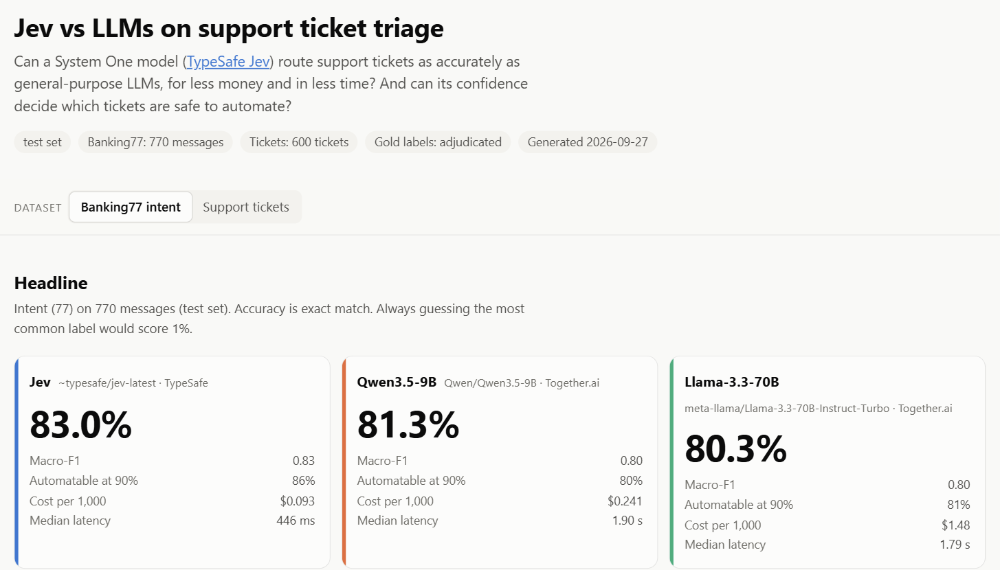
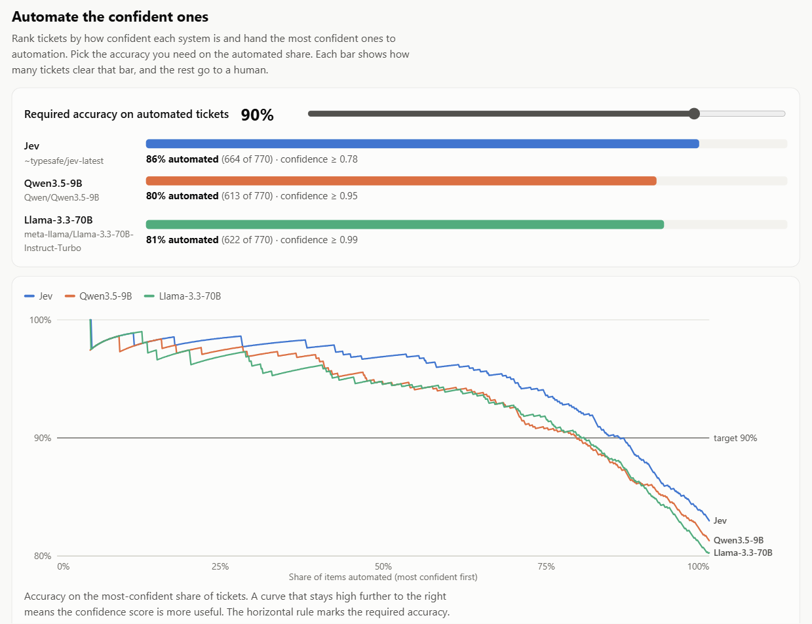
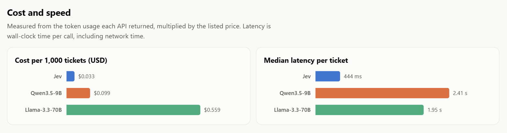
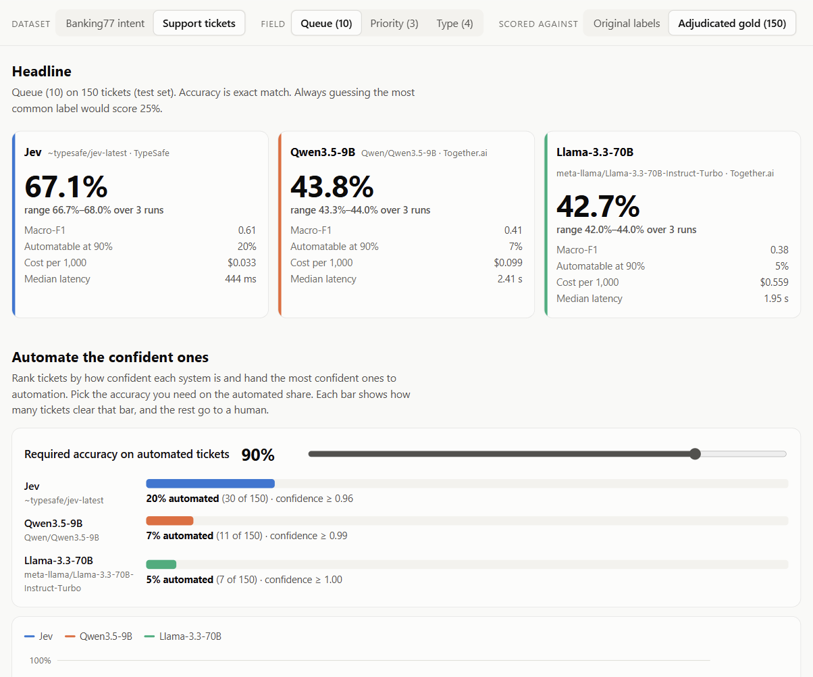
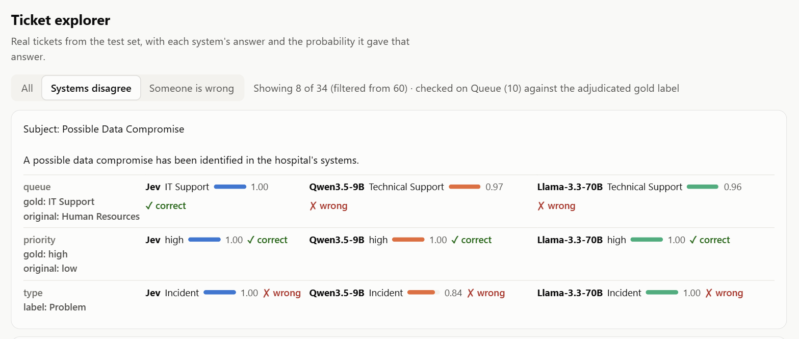

# Jev vs LLMs: customer support ticket triage

Does a **System One** model ([TypeSafe Jev](https://docs.typesafe.ai/introduction)) triage support
tickets as well as general-purpose LLMs, at a fraction of the cost and latency? And can its
confidence score decide which tickets are safe to automate?

**Live dashboard: https://beese54.github.io/jev-ticket-triage/**

| System | How it is asked |
|---|---|
| TypeSafe Jev (`jev-1.13`, via OpenRouter as `~typesafe/jev-latest`) | typed questions (Choice / Score / Noul), one request per ticket |
| `Qwen/Qwen3.5-9B` (Together.ai) | small LLM: prompt + JSON output restricted to valid labels |
| `meta-llama/Llama-3.3-70B-Instruct-Turbo` (Together.ai) | large LLM: same prompt |

## Results at a glance (test set)

| | Jev | Qwen3.5-9B | Llama-3.3-70B |
|---|---|---|---|
| Banking77 intent accuracy (770 messages, 77 intents) | **83.0%** | 81.3% | 80.3% |
| Banking77 share automatable at 90% accuracy | **86%** | 80% | 81% |
| Tickets vs hand-checked labels: queue | **67.1%** | 43.8% | 42.7% |
| Tickets vs hand-checked labels: priority | 73.8% | 77.1% | **81.8%** |
| Tickets vs hand-checked labels: type | **84.2%** | 63.1% | 72.2% |
| Calibration error, ECE (lower = confidence means what it says) | **0.06–0.14** | 0.11–0.33 | 0.17–0.50 |
| Median latency per ticket | **~0.44 s** | 1.9–2.4 s | 1.8–2.0 s |
| Cost per 1,000 Banking77 messages | **$0.09** | $0.24 | $1.48 |

Ticket results are the mean of 3 runs. The whole Jev evaluation (4,951 calls) cost $0.16.

### Same messages, same label descriptions, three systems



On Banking77, a well-known intent benchmark with reliable labels, all three systems are close on
accuracy. The differences are in cost and speed: Jev is about 4× faster and costs a fraction of
either LLM.

### Can the confidence score decide what to automate?



Sort messages from most to least confident and hand the top ones to automation. The chart shows
the accuracy on the automated share as you automate more. A line that stays high for longer means
the confidence score is more useful. At a 90% accuracy target, Jev's confidence lets 86% of
messages through, against 80–81% for the LLMs.

### Cost and speed per ticket



Cost comes from the token counts each API reported, times the list price. Latency is wall-clock
time per call, including the network.

### Support tickets, scored against hand-checked labels



The ticket dataset's own labels turned out to be unreliable: on 150 test tickets they matched the
hand-checked labels for only 47% of queues and 53% of priorities. So ticket results are scored
against those checked labels (the dashboard also shows the original-label scores). Jev leads on
queue and type, and the LLMs lead on priority.

### A real ticket



The dashboard's ticket explorer shows each system's answer and the probability it gave. This one
shows both effects at once: the original dataset label was wrong ("Human Resources, low"), and the
LLMs sent it to the catch-all "Technical Support".

## How the benchmark works

1. **The task.** Each system reads a message and labels it. Both datasets are public on Hugging Face.
   **Banking77** ([PolyAI/banking77](https://huggingface.co/datasets/PolyAI/banking77), Casanueva et
   al., 2020): 770 real banking customer messages from its official test split, one of 77 intents
   each (10 per intent). **Support tickets**
   ([Tobi-Bueck/customer-support-tickets](https://huggingface.co/datasets/Tobi-Bueck/customer-support-tickets),
   by Tobias Bueck): 600 synthetic English tickets, each with a queue (10 teams), a priority
   (low / medium / high) and a type (Incident / Problem / Request / Change).
2. **Same information for everyone.** Every label name and its one-line description lives in one
   file, [`src/triage/labels.py`](src/triage/labels.py), and all three systems get exactly that
   text. Jev gets it as typed questions and returns a probability for every option. The LLMs get
   it in a prompt, run at temperature 0, and must reply in JSON that only allows valid labels.
   Their confidence is the probability they gave the words of their chosen label. An invalid
   answer counts as wrong.
3. **Fair splits.** The data is split into dev (for tuning), test (reported results) and holdout
   (a final overfitting check). Label descriptions were only ever changed on dev: one change was
   tried there and reverted because it made results worse, and nothing was tuned for Jev.
   Because the LLMs vary a little between runs even at temperature 0, every ticket test was run 3
   times and averaged. The full log is in [`tasks/eval_ledger.md`](tasks/eval_ledger.md).
4. **What's measured.** Accuracy (exact match) and macro-F1; how much can be automated at a
   target accuracy when ranking by confidence; calibration (when a system says 90% confident, is
   it right about 90% of the time?); cost from reported token usage; and latency.
5. **Fixing the labels.** For 150 test tickets (15 per queue), a blind first pass was drafted and
   compared with the original labels. Where they disagreed, a human picked the right label,
   seeing the two options as "A" and "B" in random order. Rules: [`data/gold/RUBRIC.md`](data/gold/RUBRIC.md).
6. **Reproducible.** Every raw API response is saved in [`cache/`](cache/), and every number here
   and on the dashboard is rebuilt from it with one command. No API keys are needed.

## Caveats
- The hand-checked set is small (150 tickets), so differences of a few points on it are within noise.
- The reviewer never chose "neither", so every checked label is either the original or the blind
  first pass, and that first pass was drafted by an LLM (Claude, which is not one of the systems
  compared). That could favour the LLM baselines. In the other direction, the checked labels follow
  the rubric's reading of "IT Support" (the customer's own infrastructure) and "General Inquiry"
  (advice requests). Most of Jev's queue lead comes from those two queues, which the LLMs almost
  never chose ([`results/per_queue_gold.json`](results/per_queue_gold.json)).
- The ticket data is synthetic. Banking77 is the cleaner comparison.
- Jev was called through OpenRouter. Its latency includes that extra hop, and the price matched
  TypeSafe's published $0.042 per million input tokens.

## Datasets
Both come from Hugging Face. Only small, frozen subsets are used ([`data/README.md`](data/README.md) has the exact files, hashes and cleaning rules).

| Dataset | Source | License | Used here |
|---|---|---|---|
| **Banking77**: real banking customer queries, 77 intents, clean labels | [PolyAI/banking77](https://huggingface.co/datasets/PolyAI/banking77) (raw files: [PolyAI-LDN/task-specific-datasets](https://github.com/PolyAI-LDN/task-specific-datasets)). Paper: Casanueva et al., 2020, [*Efficient Intent Detection with Dual Sentence Encoders*](https://arxiv.org/abs/2003.04807) | CC-BY-4.0 | 1,001 messages from the official test split (dev 154 / test 770 / holdout 77) |
| **Customer Support Tickets**: synthetic helpdesk emails with queue, priority, type | [Tobi-Bueck/customer-support-tickets](https://huggingface.co/datasets/Tobi-Bueck/customer-support-tickets) by Tobias Bueck, DOI 10.57967/hf/6184 | CC-BY-NC-4.0 (non-commercial) | English rows of `aa_dataset-tickets-multi-lang-5-2-50-version.csv` (dev 100 / test 600 / holdout 50) |

Frozen splits live in [`data/splits/`](data/README.md).

## Layout
| Path | What |
|---|---|
| `src/triage/` | labels, tasks, backends (Jev SDK / Together HTTP), runner, cache, metrics, report |
| `cache/` | **every raw API response** (gzipped JSON), keyed by a hash of the exact request |
| `results/` | metrics and explorer JSON, regenerated from `cache/` |
| `data/gold/` | rubric, blind first pass, review decisions for the hand-checked labels |
| `dashboard/`, `docs/` | dashboard and review-page templates, and the built pages (GitHub Pages) |
| `analysis/` | label-semantics, confusion, determinism and per-queue analyses |
| `tasks/` | plan (`todo.md`) and evaluation ledger (`eval_ledger.md`) |

## Reproduce
```sh
uv sync

# rebuild the numbers and the dashboard from the committed cache: no API keys needed
uv run python scripts/report.py --split test
uv run python scripts/build_dashboard.py --split test
uv run pytest

# to re-run a system, add keys first (cached calls are reused, new ones are saved)
cp .env.example .env                    # TOGETHER_API_KEY, and TYPESAFE_API_KEY or OPENROUTER_API_KEY
git config core.hooksPath scripts/hooks # pre-commit hook that blocks committing secrets
uv run python scripts/run_all.py --system jev
```

## License
Code: MIT. Datasets keep their own licenses (the ticket dataset is non-commercial).
